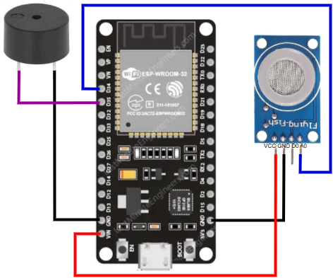

## En construcción 🚧

#  Detector de Monóxido de Carbono con ESP32 🔥

Este proyecto utiliza un **ESP32** y un sensor de gas (como el **MQ-7** ) para detectar niveles peligrosos de monóxido de carbono en el ambiente. Cuando se supera un umbral definido, el sistema activa una **alarma sonora** (buzzer) y puede visualizar información en una página web local.

## 🧠 Funcionalidades

- Lectura continua del nivel de gas.
- Alarma sonora mediante buzzer cuando se detecta una concentración elevada.
- Interfaz web básica para monitorear el estado del sistema en tiempo real.
- Código adaptable para futuras mejoras (como envío de alertas por Telegram o registro de datos).

## 🧰 Componentes utilizados

- Placa ESP32
- Sensor de gas (MQ-7)
- Buzzer activo
- Cables y protoboard
- Conexión WiFi para la página web local

## 📐 Esquema de conexión

## 📝 Notas

- El umbral de activación de la alarma (`threshold`) se puede ajustar en el código según la sensibilidad del sensor.
- Esta es una versión básica. No reemplaza un detector certificado de monóxido.
